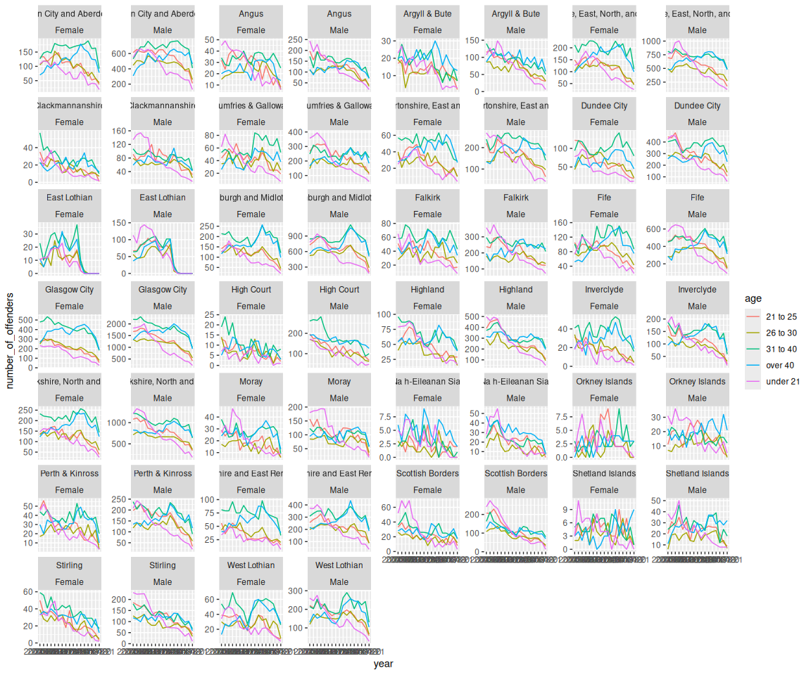
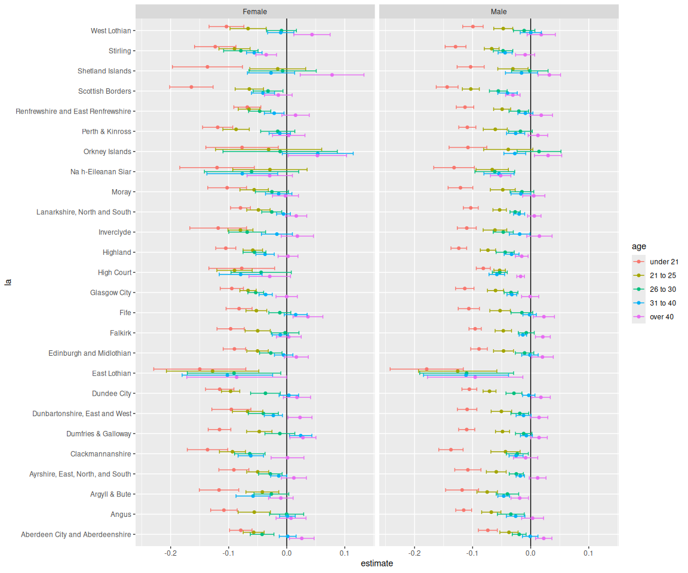

# Exploratory analysis of reconvictions data
Ben Matthews

## Setting up

Load up packages.

``` r
library(readxl)
library(here)
```

    here() starts at /home/work/Documents/research/reconviction-rates-scotland

``` r
library(tidyverse)
```

    ── Attaching core tidyverse packages ──────────────────────── tidyverse 2.0.0 ──
    ✔ dplyr     1.1.4     ✔ readr     2.1.5
    ✔ forcats   1.0.0     ✔ stringr   1.5.1
    ✔ ggplot2   3.5.1     ✔ tibble    3.2.1
    ✔ lubridate 1.9.4     ✔ tidyr     1.3.1
    ✔ purrr     1.0.2     

    ── Conflicts ────────────────────────────────────────── tidyverse_conflicts() ──
    ✖ dplyr::filter() masks stats::filter()
    ✖ dplyr::lag()    masks stats::lag()
    ℹ Use the conflicted package (<http://conflicted.r-lib.org/>) to force all conflicts to become errors

Read in the data. There are lots of sheets - this has age and gender
data for each ‘LA’ from 2004-21.

``` r
tmp <- read_xlsx(here("01_data",
               "reconvictions-2020-21-offender-cohort-additional-datasets.xlsx"),
          sheet = "AGdata",
          skip = 4)
```

    New names:
    • `` -> `...1`
    • `` -> `...2`
    • `` -> `...3`
    • `` -> `...11`
    • `` -> `...12`
    • `` -> `...13`
    • `` -> `...14`

``` r
tmp <- 
tmp |> 
  select(-...11:-...14) |> 
  select(-...1) |> 
  rename(la = ...2,
         year = ...3) |> 
  janitor::clean_names() |> 
  filter(la != "LA")
```

## Initial analysis

Filter out the aggregated rows and then just plot the raw numbers of
people convicted across LAs in each year by age and gender

``` r
reconv <- 
tmp |> 
  filter(age != "All",
         gender != "All",
         la != "Not known")

reconv |> 
  ggplot(aes(x = year, y = number_of_offenders, colour = age, group = interaction(age, gender))) +
  geom_line() +
  facet_wrap(la ~ gender, scales = "free_y")
```



So it looks like the trend is generally downwards for young people but
less clear for older people, regardless of gender. We can test whether
the linear trend for each age is downwards pretty simply. I’m not sure
if we need the *quasi* poisson bit here but feels like it should help
with the confidence intervals and stuff.

``` r
reconv <- 
reconv |> 
  mutate(year = as.numeric(str_sub(year, 1, 4)))

reconv <- 
reconv |> 
  mutate(age = factor(age,
                      levels = c("under 21",
                                 "21 to 25",
                                 "26 to 30",
                                 "31 to 40",
                                 "over 40")))

reconv |> 
  group_by(la, gender, age) |> 
  nest() |> 
  mutate(model = map(data, ~ glm(number_of_offenders ~ year, family = "quasipoisson", data = .x)),
         results = map(model, broom::tidy)) |> 
  unnest(results) |> 
  filter(term!= "(Intercept)") |> 
  mutate(conf_low = estimate - 1.96 * std.error,
         conf_upp = estimate + 1.96 * std.error) |> 
  ggplot(aes(x = estimate, y = la, colour = age)) +
  geom_vline(xintercept = 0) +
  geom_point(position = position_dodge(width = -0.5)) +
  geom_errorbar(aes(xmin = conf_low, xmax = conf_upp),
                position = position_dodge(width = -0.5)) +
  facet_wrap(~ gender)
```

    Warning: `position_dodge()` requires non-overlapping x intervals.
    `position_dodge()` requires non-overlapping x intervals.



For every LA (and high court) the linear slope is negative for young
people, and for most of the 21-25 group too. For most of the LAs there
is no linear trend for older people.

So the demographics of people convicted in Scotland are changing quite a
lot. Implications: all else equal, more people being convicted will be
parents (as they are more likely to be of parenting age)? Could check
the overall parity statistics by age to assess this.
